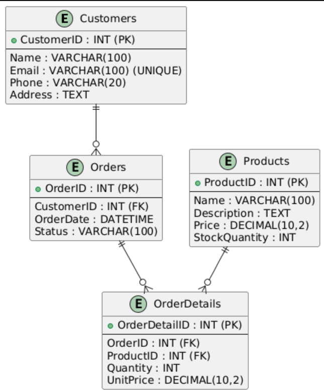

# Database Exercise - salesDB

## Objective
If the goal is just to answer the basic questions, here are the answers:

**Create file `answers.sql` in your repo and push in your code** 

1. Create a new database `salesDB`:
   
   ```sql
   CREATE DATABASE salesDB;
   ```

2. Delete database `demo` :
   ```sql
   DROP DATABASE demo;
   ```

## For more
But, if you want a big answer to create database (your level in database to depend) :

**Create file `answers.sql` in your repo and push in your code** 

```sql
-- Create the database
CREATE DATABASE salesDB;
USE salesDB;

-- Create the Customers table
CREATE TABLE Customers (
    CustomerID INT PRIMARY KEY AUTO_INCREMENT,
    Name VARCHAR(100) NOT NULL,
    Email VARCHAR(100) UNIQUE NOT NULL,
    Phone VARCHAR(20),
    Address TEXT
);

-- Create the Products table
CREATE TABLE Products (
    ProductID INT PRIMARY KEY AUTO_INCREMENT,
    Name VARCHAR(100) NOT NULL,
    Description TEXT,
    Price DECIMAL(10,2) NOT NULL,
    StockQuantity INT NOT NULL
);

-- Create the Orders table
CREATE TABLE Orders (
    OrderID INT PRIMARY KEY AUTO_INCREMENT,
    CustomerID INT,
    OrderDate DATETIME DEFAULT CURRENT_TIMESTAMP,
    Status VARCHAR(100),
    FOREIGN KEY (CustomerID) REFERENCES Customers(CustomerID) ON DELETE CASCADE
);

-- Create the OrderDetails table
CREATE TABLE OrderDetails (
    OrderDetailID INT PRIMARY KEY AUTO_INCREMENT,
    OrderID INT,
    ProductID INT,
    Quantity INT NOT NULL,
    UnitPrice DECIMAL(10,2) NOT NULL,
    FOREIGN KEY (OrderID) REFERENCES Orders(OrderID) ON DELETE CASCADE,
    FOREIGN KEY (ProductID) REFERENCES Products(ProductID) ON DELETE CASCADE
);

```

To see diagram model database paste this in PlantUML or look a photo : https://www.plantuml.com/plantuml/ 

```planUML
@startuml
entity Customers {
    + CustomerID : INT (PK)
    --
    Name : VARCHAR(100)
    Email : VARCHAR(100) (UNIQUE)
    Phone : VARCHAR(20)
    Address : TEXT
}

entity Products {
    + ProductID : INT (PK)
    --
    Name : VARCHAR(100)
    Description : TEXT
    Price : DECIMAL(10,2)
    StockQuantity : INT
}

entity Orders {
    + OrderID : INT (PK)
    --
    CustomerID : INT (FK)
    OrderDate : DATETIME
    Status : ENUM('Pending', 'Shipped', 'Delivered', 'Cancelled')
}

entity OrderDetails {
    + OrderDetailID : INT (PK)
    --
    OrderID : INT (FK)
    ProductID : INT (FK)
    Quantity : INT
    UnitPrice : DECIMAL(10,2)
}

Customers ||--o{ Orders
Orders ||--o{ OrderDetails
Products ||--o{ OrderDetails
@enduml
```


